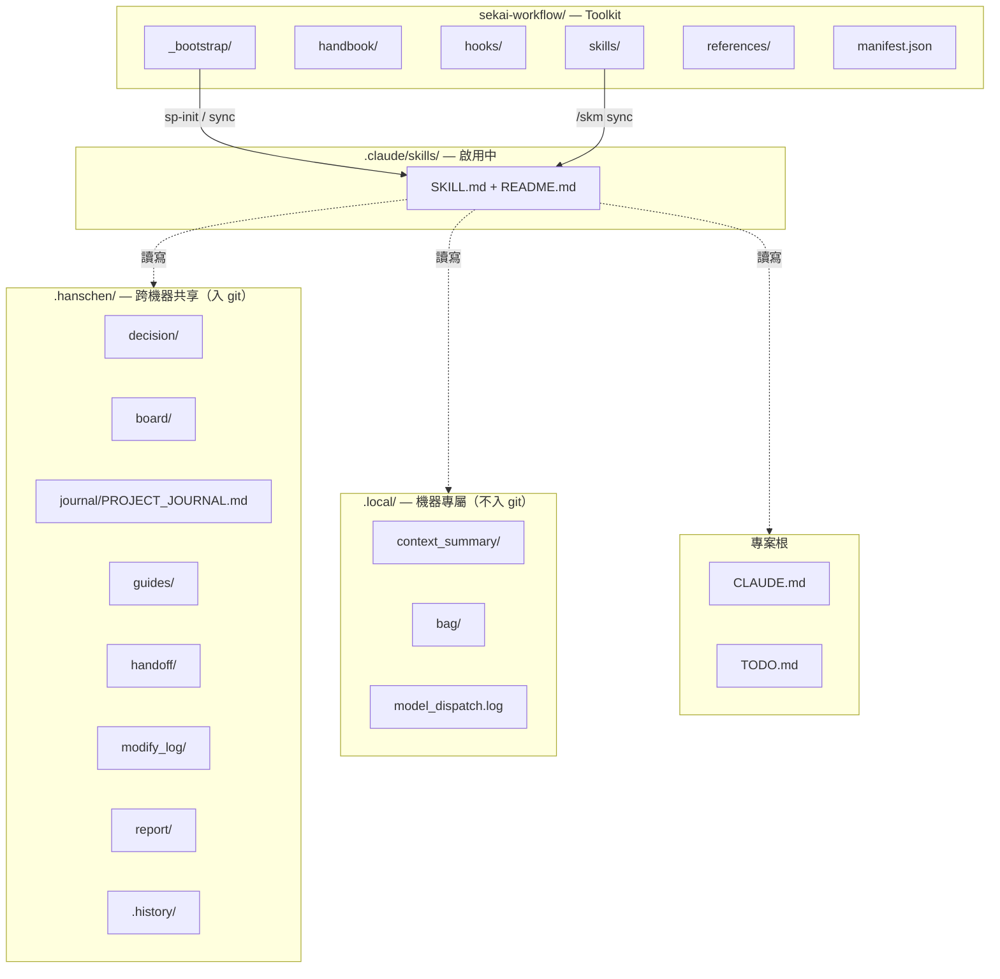

# Sekai-workflow 產出文件架構圖

> **用途**：一張圖看懂所有 Skill 產出的文件落點、生命週期、觸發鏈與跨檔關聯。
>
> **雙視角設計**：
> - **AI 視角**：節點與邊以純文字／表格呈現，可被 grep / 解析，作為「我要寫到哪？讀哪？」的索引
> - **人類視角**：附 Mermaid 圖（GitHub 直接渲染）+ ASCII 圖（CLI 直接看）
>
> **權威來源**：
> - 路徑邊界 → `.hanschen/.history/README.md` §1
> - 檔案產出明細 → `sekai-workflow/docs/file-output-reference.md`
> - Skill 索引 → `sekai-workflow/manifest.json`
> - 本檔負責「彼此如何串接」的全景視圖
>
> Last updated: 2026-05-13

---

## 1. 空間總覽（三層 + 一個 toolkit）

```
┌─────────────────────────────────────────────────────────────────────────┐
│  專案根（your-project/）                                                │
│  ├── CLAUDE.md                          ← 規則總綱（auto-loaded）       │
│  ├── TODO.md                            ← /team todo + /build do 衍生  │
│  ├── .gitignore                                                         │
│  │                                                                       │
│  ├── .hanschen/    ════════════════════ 跨機器共享文件（入 git）         │
│  │   ├── decision/                      ← /team decide                  │
│  │   ├── board/                         ← /team board                   │
│  │   ├── journal/PROJECT_JOURNAL.md     ← 結案 append-only 索引         │
│  │   ├── guides/                        ← /team note + /commit-push S10 │
│  │   ├── handoff/                       ← /team handoff                 │
│  │   ├── modify_log/                    ← /commit-push S5（Haiku）      │
│  │   ├── report/                        ← /team report --daily          │
│  │   └── .history/                      ← refactor.jsonl + 邊界規格     │
│  │                                                                       │
│  ├── .local/      ════════════════════ 機器專屬狀態（不入 git）         │
│  │   ├── context_summary/               ← /clean                        │
│  │   ├── bag/                           ← /skm pack                     │
│  │   ├── resumption_prompt.md           ← /clean 一次性 hook 注入       │
│  │   └── model_dispatch.log             ← Agent 派遣稽核                │
│  │                                                                       │
│  ├── .claude/skills/   ════════════════ 啟用中的 skill（不入 git）       │
│  │   └── <skill>/SKILL.md + README.md   ← Claude 載入點                 │
│  │                                                                       │
│  └── sekai-workflow/   ════════════════ Toolkit（獨立 repo）             │
│      ├── skills/<name>/                 ← 上游 skill 模板               │
│      ├── handbook/                      ← /kb 跨專案技術知識庫          │
│      ├── hooks/                         ← Claude Code hooks（.cjs）     │
│      ├── _bootstrap/                    ← 安裝 / 同步腳本                │
│      ├── references/                    ← 跨 skill 共用 reference       │
│      ├── rules/CORE.md                  ← 簡化版規則模板                 │
│      ├── docs/                          ← 本檔所在地                     │
│      └── manifest.json                  ← 機器可讀 skill index          │
└─────────────────────────────────────────────────────────────────────────┘
```

### Mermaid 版（GitHub 渲染）



---

## 2. Skill → 產出對應圖（誰寫什麼）

```
/hello          ──┬─► .local/context_summary/        ← 讀取恢復狀態
                  ├─► TODO.md                        ← 重建未完成項
                  └─► (.hanschen/decision + board)   ← 掃描 open 狀態

/build plan     ──► (對話內輸出，不寫檔)              ← 規劃以 AskUserQuestion 收斂
/build do       ──► TODO.md（Pending 衍生）           ← 動工發現新任務
/build check    ──► (stdout only, no file)

/commit-push    ──┬─► .hanschen/modify_log/YYMMDD_*  ← Step 5（Haiku）
                  ├─► .hanschen/guides/<topic>.md    ← Step 10（踩坑經驗）
                  ├─► .hanschen/report/YYMMDD_*      ← Step 11（auto append daily）
                  └─► README.md（變更目錄下）         ← Step 2

/team todo      ──► TODO.md
/team board     ──┬─► .hanschen/board/YYMMDD_*_board.md
                  ├─► (結案) CLOSED_ rename + 內嵌摘要
                  └─► .hanschen/journal/PROJECT_JOURNAL.md（auto append 索引）

/team decide    ──┬─► .hanschen/decision/YYMMDD_*_decision.md
                  ├─► (結案) CLOSED_ rename + 內嵌摘要
                  ├─► .hanschen/journal/PROJECT_JOURNAL.md（auto append 索引）
                  └─► TODO.md（auto append 遺留項，Rule 17.1.4）

/team note      ──► .hanschen/guides/<topic>.md
/team handoff   ──┬─► .hanschen/handoff/YYMMDD_handoff.md
                  └─► .hanschen/handoff/YYMMDD_ai-context/（bundle 目錄）
/team report    ──► .hanschen/report/YYMMDD_daily_report.md（--daily）
/team journal   ──► .hanschen/journal/PROJECT_JOURNAL.md（讀寫）
/team follow-up ──► 既有 board/decide 檔（多輪續做）

/skm new        ──┬─► .claude/skills/<name>/SKILL.md + README.md
                  └─► sekai-workflow/skills/<name>/...（mirror）
/skm sync       ──► .claude/skills/ ↔ sekai-workflow/skills/
/skm pack       ──► .local/bag/<name>.zip + manifest.txt
/skm update     ──► sekai-workflow/skills/<name>/...

/kb add         ──► sekai-workflow/handbook/<topic>.md
/kb extract     ──► sekai-workflow/handbook/<topic>.md（從結案摘要抽）
/kb search      ──► (stdout only)

/ask <field>    ──► (stdout only — 資料流追蹤)

/clean          ──┬─► .local/context_summary/YYMMDD_HHMM_*.md
                  ├─► .local/context_summary/current_topic.md
                  └─► .local/resumption_prompt.md（一次性，注入後刪除）

/memo           ──► sekai-workflow/memo/（memory 攜帶）

/dispatch       ──► .local/model_dispatch.log（append 一行）
```

---

## 3. 文件生命週期狀態

### 3.1 互動式決策／白板（`decide` / `board`）

```
┌──────────┐   勾選 + 補充說明    ┌──────────┐   實作完成     ┌────────────────┐
│  open    │ ───────────────────► │ in-impl  │ ───────────►   │ CLOSED_ rename │
│ <topic>  │                      │          │                │ + 內嵌結案摘要 │
└──────────┘                      └──────────┘                └────────┬───────┘
                                                                       │
                                                                       ▼
                                                         ┌──────────────────────┐
                                                         │ PROJECT_JOURNAL.md   │
                                                         │ auto append 索引列   │
                                                         └──────────────────────┘
```

| 狀態 | 檔名 | 意義 |
|---|---|---|
| open | `YYMMDD_<topic>_decision.md` / `_board.md` | 進行中，可被 `/team follow-up` 接續 |
| CLOSED | `CLOSED_YYMMDD_<topic>_*.md` | 已結案，永久保留作為「某決定從何而來」唯一來源 |

**結案後副作用**（Rule 17.1.4 擴充）：
- 實作項 + 遺留項 → auto append `TODO.md` Pending
- 跨專案技術內容 → auto extract 至 `sekai-workflow/handbook/`（`/kb extract`）

### 3.2 TODO 三段制

```
Pending ─────────────► In Progress ────────────► Completed
   ↑                        ↑                        │
   │                        │                        ▼
btw/順便（自動）         動工開始               歸檔區（>30 天清）
未來嘗試（自動）         /build do
decide 結案遺留項        實作開始
```

### 3.3 Context Summary（`.local/`）

```
對話進行 ─► /clean check ─► /clean force ──► YYMMDD_HHMM_<topic>.md
                                           + current_topic.md
                                           + resumption_prompt.md  ──► /clear
                                                                         │
                                                                         ▼
                                                          下次對話 hook 注入恢復
                                                          （注入後刪除 resumption）
```

---

## 4. 自動觸發鏈（誰呼叫誰）

```
/commit-push 完整流程：
  Step 0  (Rule 28) 雙 clone 分歧偵測  ─► 阻擋或警示
  Step 1  Opus 品質檢查 + Skill/規則完整性檢查 (Rule 27)
  Step 1.6 規則異動回填 checklist     ─► 阻擋未補回填
  Step 2  README 同步
  Step 5  Haiku 修改日誌              ─► .hanschen/modify_log/
  Step 7  commit + push（sekai-workflow flowback 依開關）
  Step 10 踩坑經驗整理                 ─► .hanschen/guides/
  Step 11 daily report append          ─► .hanschen/report/YYMMDD_*

/team board 結案：
  Step 3.5  ─► 呼叫 /team report --daily（自動）
  結束     ─► PROJECT_JOURNAL.md append + TODO.md append + /kb extract

/team decide 結案：
  Step 6.6  ─► 呼叫 /team report --daily（自動）
  結束     ─► PROJECT_JOURNAL.md append + TODO.md append + /kb extract

/hello 流程：
  Step 0   (Rule 28) 雙 clone 分歧偵測  ─► 警示
  Step 1   拉取 sekai-workflow + /skm sync
  Step 2   恢復 context（讀 .local/context_summary/）
  Step 3   工作狀態重建（掃描 open decide/board → 合併入 TODO）
  Step 3.4 跨日檢查（提醒未完成 daily report）

/clean 流程：
  /clean check  ─► 評估必要性
  /clean force  ─► 寫摘要 + resumption_prompt → /clear
```

---

## 5. 跨檔關聯快查表

| 來源 | 目的地 | 觸發 |
|---|---|---|
| `.hanschen/decision/*` 結案 | `.hanschen/journal/PROJECT_JOURNAL.md` | auto append 索引列 |
| `.hanschen/decision/*` 結案 | `TODO.md` Pending | auto append 實作項 + 遺留項 |
| `.hanschen/board/*` 結案 | `.hanschen/journal/PROJECT_JOURNAL.md` | auto append 索引列 |
| `.hanschen/board/*` 結案 | `.hanschen/report/YYMMDD_daily_report.md` | board Step 3.5 自動呼叫 daily |
| `.hanschen/modify_log/*` | `.hanschen/report/YYMMDD_daily_report.md` | commit-push Step 11 |
| `.hanschen/decision/CLOSED_*` | `sekai-workflow/handbook/` | `/kb extract`（技術內容） |
| `.local/context_summary/*` | 下次對話開頭 | UserPromptSubmit hook |
| `.local/resumption_prompt.md` | 下次對話開頭（注入後刪除） | UserPromptSubmit hook |
| Memory（`~/.claude/projects/<path>/memory/`） | `sekai-workflow/memo/` | `/memo` 跨專案攜帶 |
| `sekai-workflow/_bootstrap/RENAME_HISTORY.md` | 所有 SKILL.md / README.md | 全域改名單一檢核點（Rule 24） |
| `sekai-workflow/manifest.json` | Claude 讀取入口 | 機器可讀 skill index |

---

## 6. AI 讀檔索引（快速定位）

| 我要做什麼 | 讀哪 |
|---|---|
| 知道某 skill 怎麼用 | `sekai-workflow/skills/<name>/SKILL.md` |
| 知道某 skill 對人類說明 | `sekai-workflow/skills/<name>/README.md` |
| 知道某 skill 的細節規則 | `sekai-workflow/skills/<name>/references/<rule>.md` |
| 知道規則總綱 | `CLAUDE.md` |
| 知道某產出檔該放哪 | `sekai-workflow/docs/file-output-reference.md` |
| 知道 `.hanschen/` vs `.local/` 邊界 | `.hanschen/.history/README.md` §1 |
| 知道全域改名歷史 | `sekai-workflow/_bootstrap/RENAME_HISTORY.md` |
| 知道路徑遷移記錄 | `.hanschen/.history/refactor.jsonl` |
| 知道 model 路由表 | `sekai-workflow/references/model-routing.md` |
| 知道 skill 全貌 | `sekai-workflow/manifest.json` |
| 知道過往決策 | `.hanschen/decision/CLOSED_*.md` 內嵌結案摘要 |
| 知道專案歷程 | `.hanschen/journal/PROJECT_JOURNAL.md` |
| 知道 Agent 派遣稽核 | `.local/model_dispatch.log` |
| **知道整體架構** | **本檔（output-architecture.md）** |

---

## 7. 維護規則

1. 新增 / 改名 skill → 更新本檔 §2（產出對應圖）+ `manifest.json` + `_bootstrap/RENAME_HISTORY.md`
2. 新增自動觸發鏈 → 更新本檔 §4 + 對應 SKILL.md 的 `Cross-Skill References` 區段（Rule 24）
3. 路徑遷移 → 更新本檔 §1 + `.hanschen/.history/refactor.jsonl` + `file-output-reference.md`
4. 對 Rule 17 / 24 / 26 / 27 等檢核規則異動 → 更新本檔 §4（觸發鏈描述）

本檔屬於跨 skill 全景視圖，**不取代** SKILL.md / README.md / file-output-reference.md / `.history/README.md`；僅作為「打開一張圖看懂全貌」的入口。
